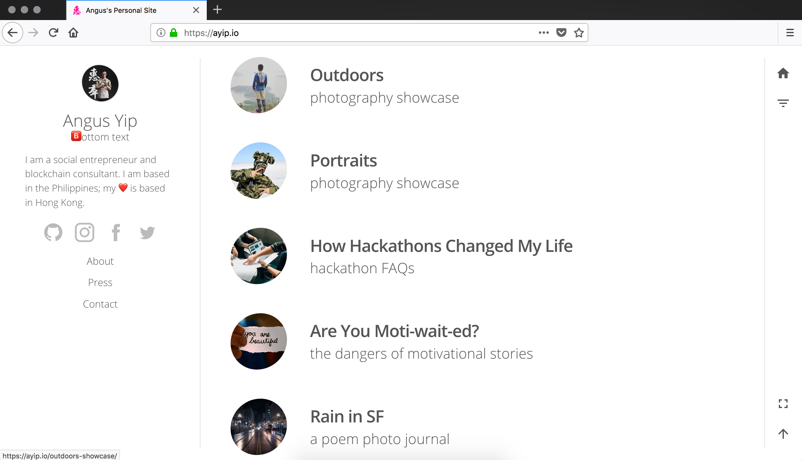

# AyipV2

Angus's personal site.

   

  

   

See the website in action » [ayip.io](https://ayip.io)

## Author

- Angus Yip [@ayip001](https://github.com/ayip001)

## Contributing

- Fork the repo
- Create your feature branch (git checkout -b feature/fooBar)
- Commit your changes (git commit -am 'Add some fooBar')
- Push to the branch (git push origin feature/fooBar)
- Create a new Pull Request

## Thanks to...

- GatsbyJS
- [This starter](https://github.com/greglobinski/gatsby-starter-personal-blog) by Greg Lobinski
- GitHub pages
