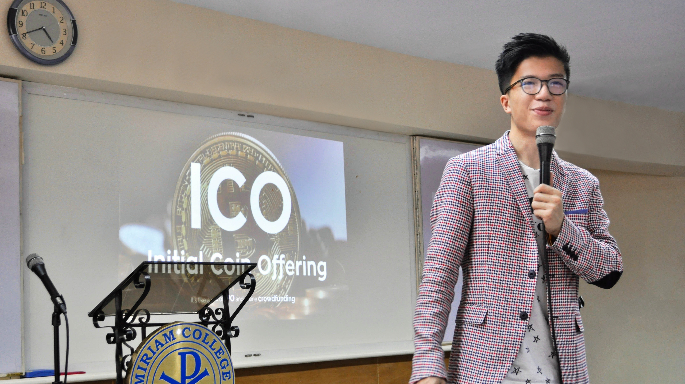

## Bio

Yip studied computer science and worked as a software engineer in Silicon Valley. He has been an active part of the developer community while studying, participating and organizing tech events such as hackathons, spanning topics including UI/UX, AI, and blockchain.

Recently, the economic growth in South East Asia and, of course, Yip's roots, were good enough reasons for him to participate in the SEA startup scene, beginning in the Philippines region and the blockchain consulting sector.

Yip's first venture, Vagrant Limited, aims to help communities escape stagnancy by providing and advocating for innovative technologies. Vagrant's first product is Blockchain by Vagrant, an ICO service company with an unimaginative name.

## Longer Bio

TODO

## High Resolution Pictures

