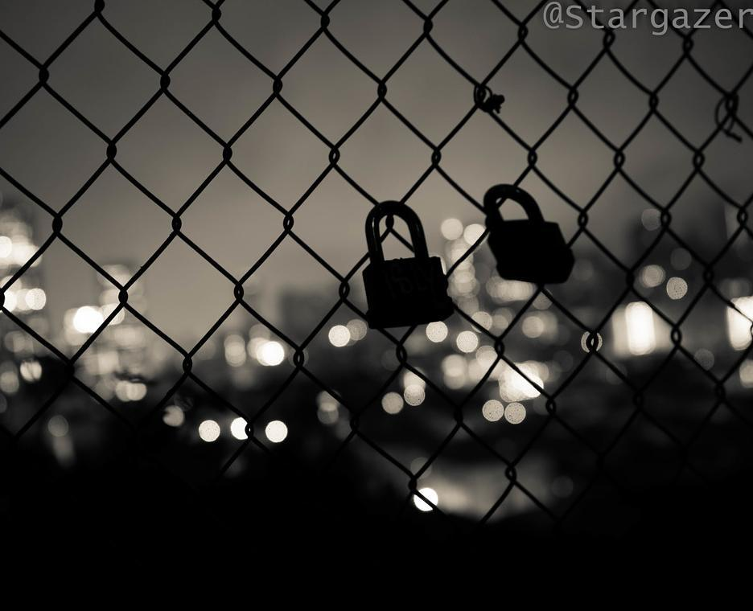

> It's therapeutic.  
> It delivered silence when  
> I was not muted.  

> I resent myself for writing this,  
> yet these thoughts I cannot dismiss.  
> "Stand by your decision," I repressed,  
> for you deserve no less than the best.  

> I wondered if you'd still hold me tight  
> and tell me "everything will be alright."  
> The answer was only melancholy.  
> "It's better for you if I remain lonely."  

> The fool overlooked the pain he caused,  
> and as you revealed it, he paused.  
> My mistakes are clear as day.  
> An ending may be the only way.  

> Do I deserve anymore trust?  
> Do I trust myself to adjust?  
> Now that I know what went wrong.  
> I was perhaps too headstrong.  

> Is it too late to be humble  
> before our world begins to crumble?  
> I will gladly trade my pride  
> for us to be side by side.  

> Is it too late to be mature  
> before we no longer have a future?  
> I will cast away my expectations  
> to make room for upcoming expeditions.  

> We have done so much together.  
> Nothing can overcome our endeavor.  
> We still have so much to do.  
> Our differences can be broken through.  

> I don't deserve a second chance.  
> It's fine if we remained friends.  
> This is my last, desperate attempt.  
> Whatever your decide, I'm content.  
