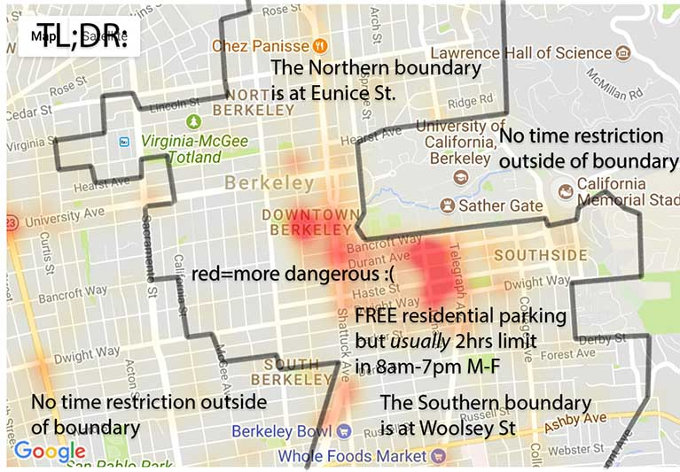
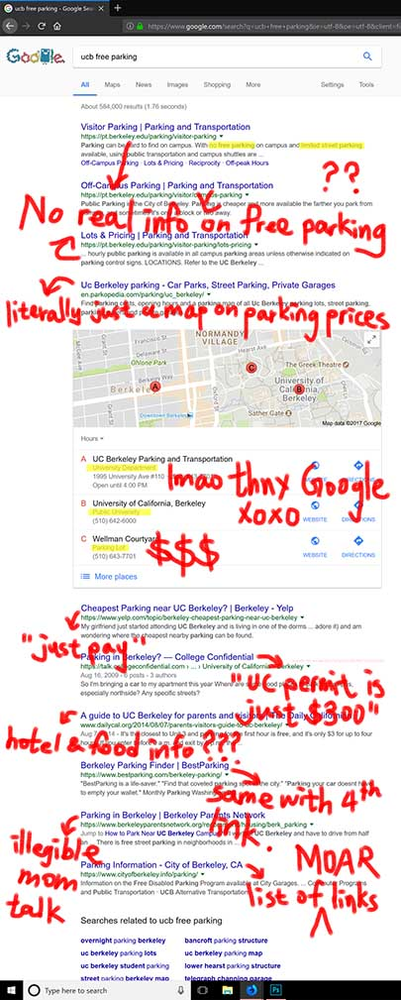
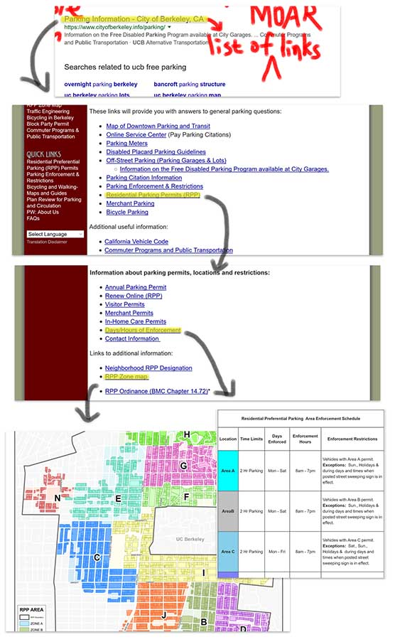
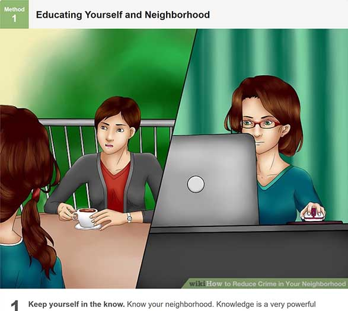
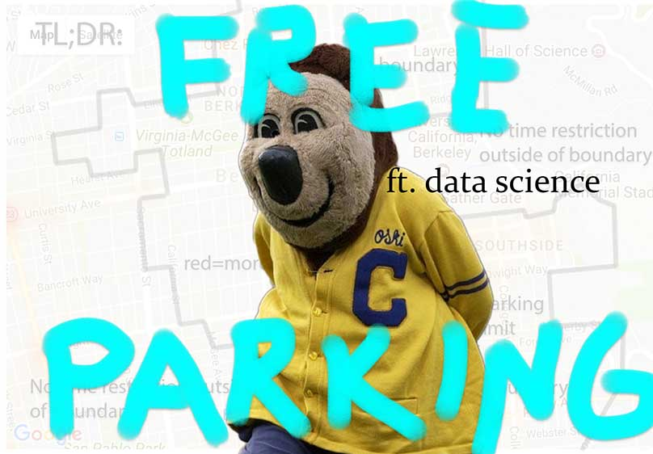

###### NOTE: THIS IS JUST A REFERENCE. PLEASE REFER TO THE STREET SIGNS FOR THE MOST ACCURATE INFORMATION. I’M NOT RESPONSIBLE IF YOU FOLLOWED THE GUIDE AND STILL GOT TICKED/BROKEN INTO

Not too long ago, I went to spend a day with a friend who goes there. I pulled into a garage and left with a hole in my wallet and an ache in my heart.

**$20 for a day pass.** With the unavoidable Bay Bridge toll of $5, I might as well use that kind of money to buy a private jet.

That’s more than enough motivation for doing research before coming by again, so I did:

Well damn it all guess I'll just have to take the BART.

Eventually, Ethereal SF Hackathon held at our favorite public university came around the corner.

After being the victim of the overall Berkeley parking situation all these times, I needed to finally take control of the situation, no matter what it takes — except when it’s parking fees.

### I just had to:

- Drive to and stay in Berkeley on Friday night till Monday night
- Leave without paying for parking **(COST)** or getting my windows smashed **(SAFETY)**

The solution for the first task was not so obvious. It took hours to find:

The resources on that page nicely told me:

- It’s OK to park in most of the zones (didn’t even know they existed) near campus, if I arrived after 5pm on Friday till Sunday night.
- Park around 10 blocks North or West of campus or near North Berkeley Station outside of zones for weekdays.

That’s half of my problem **(COST)** gone.

The other half **(SAFETY)** is a more fundamental social issue that we, as a community, need to address. There are many things that we should do for a safer community.

> “Though it may seem overwhelming, there are things you can do to manage crime in your community. You do not need to feel powerless against criminals. By taking action, you make positive changes in your neighborhood.”
>  — [WikiHow](https://www.wikihow.com/Reduce-Crime-in-Your-Neighborhood)

Just kidding.

I got the Berkeley crime dataset [here](https://data.cityofberkeley.info/Public-Safety/Berkeley-PD-Calls-for-Service/k2nh-s5h5), extracted vehicle related crimes, then [made a heatmap using Google Maps API on Jupyter](https://github.com/ayip001/jupyterdocs/blob/master/Berkeley%20parking.ipynb) to know what places to avoid. Follow that link to see comprehensive notes for the Jupyter Notebook process.

TODO: Make it self-updating and host it on a static page.

Go bears!

Courtesy to Collin Yan
