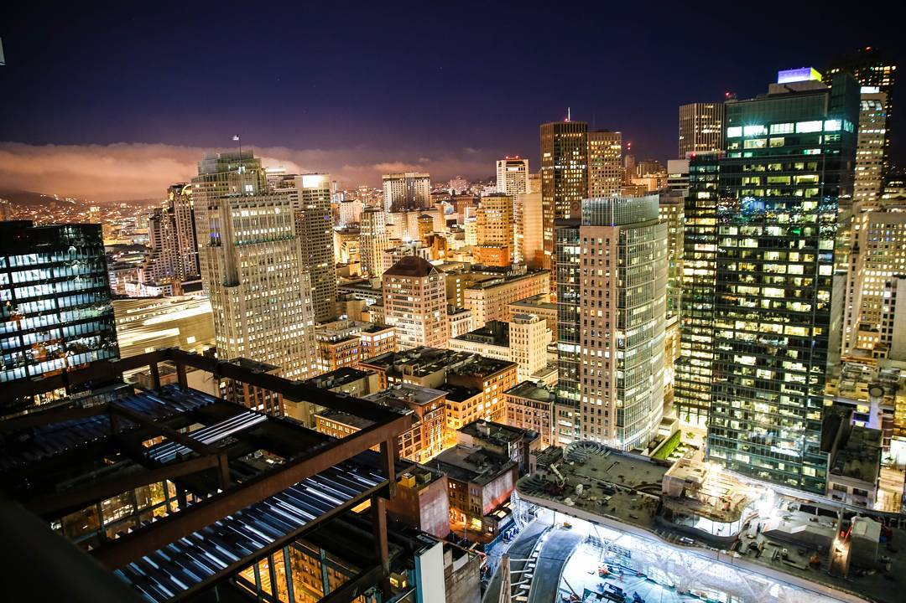
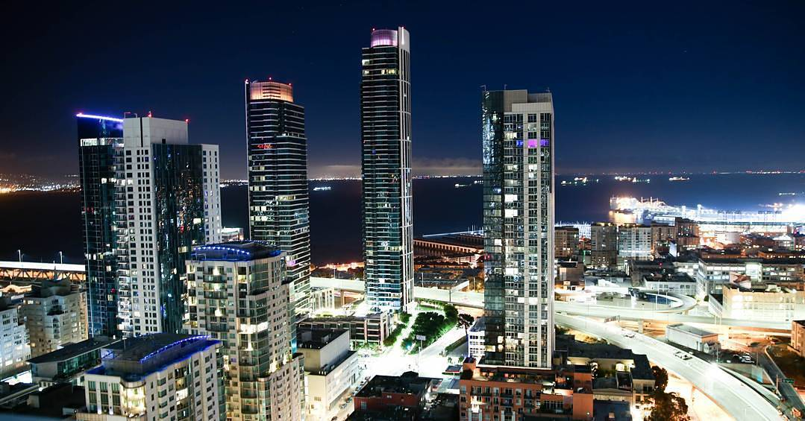
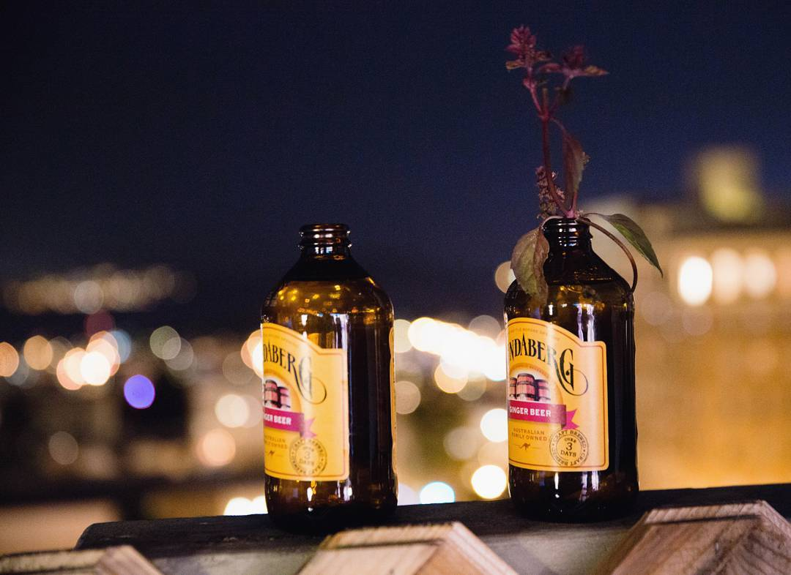
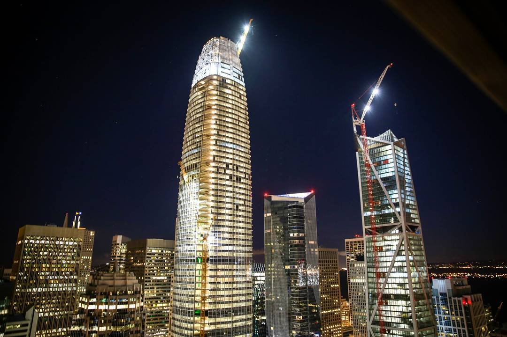
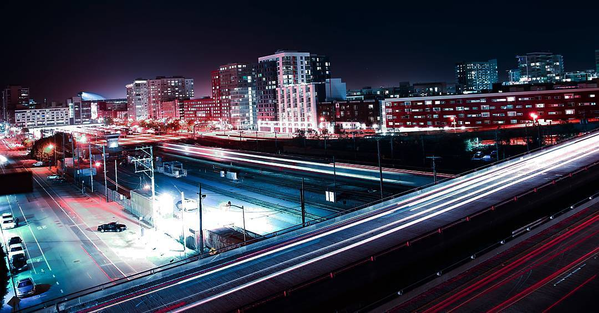
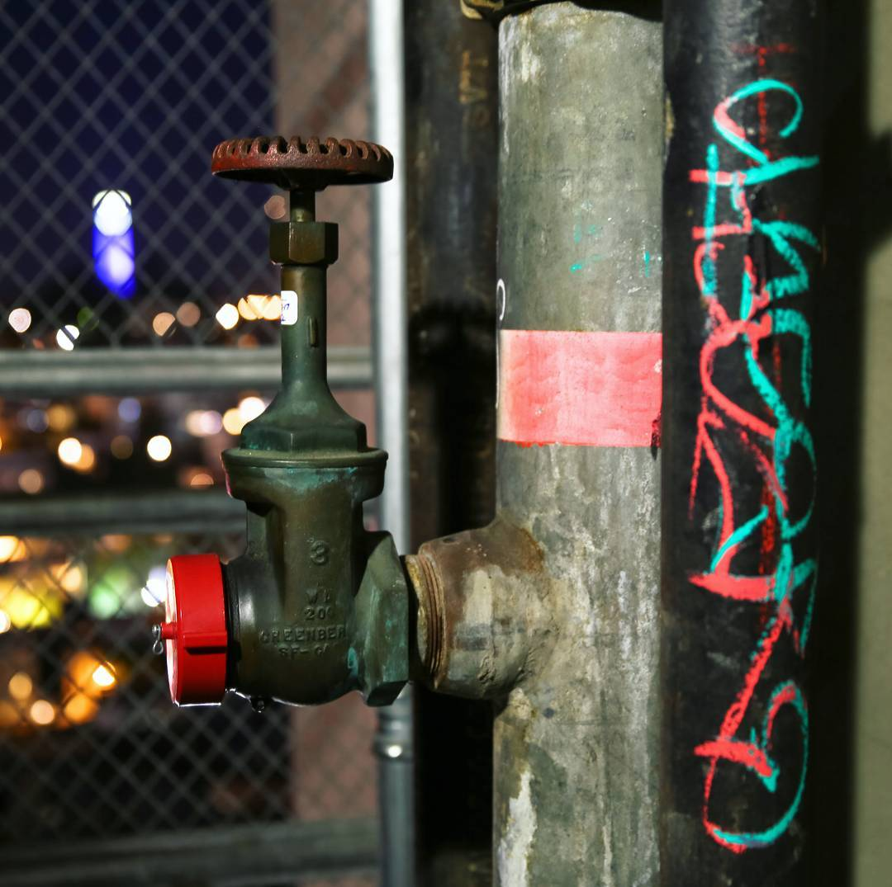

> Poems were only written  
> only when I was lonesome.  
> What if this cycle was broken?  
> Could bliss be shared more often?  

> Set your gazes upon the road.  
> What a rare sight to behold.  
> Most Bay Bridge commuters could not recount  
> the last time this little traffic was on i80 northbound.  

> The visage of blackness before it joins the radiance  
> shrouds me while I enjoy the night's cadence.  
> The building site before it joins the skyline  
> teaches me how San Francisco is pretty damn fine.  

> Frantic,  
> tears were barely bottled up by the man in a panic.  
> Sympathetic,  
> the girl behind the lost and found was profusely apologetic.  

> Together,  
> they knew that his hairtie could not be recovered.  
> Forever,  
> its sentiment gently fades away like dying ember.  

> The short, short story  
> of you and I,  
> it fades. Fade beyond  
> the starry sky.  

> I asked the clerk for roof access  
> as if I were a hotel guest.  
> "Only the owner could go there."  
> Only this view left to stare  
> Only this picture left to share  
> At the top of these very stairs  
