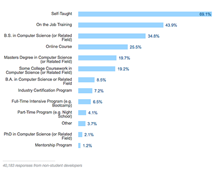

A few months back, I decided against pursuing a Bachelor’s degree in Computer Science (CS).

First, let me make it clear — I am absolutely **NOT** saying you should do the same. This is just the story behind my 0 cost college plan, which I’m rather proud of.

After one too many university rejection letters, my quest to get back on track with my life began in Winter 2015, at a community college. If everything went according to plan, I would be able to transfer out after 2–3 years, then work towards a Bachelor’s. And thus did my slog in the conventional education system begin.

5 quarters slowly went by. I dragged myself through about one and a half years of education-induced agony. Just to clarify, I love learning as much as the next person, but I’d never been fond of the traditional education system. It had always been too rigid, too creativity-stifling for my taste.

Great relief and excitement shortly followed alongside the Summer of 2017. Freedom from school! And so, I filled the calendar with as many events relevant to my interests and career that I could find on Eventbrite and Meetup. I would recommend anyone from most any field to do the same, especially if you live near a major city.

Over the Summer, I met dozens of new people, and mingled with others walking a similar path. Exposing myself to so many unique perspectives caused my own outlook to shift, so I started asking myself some very important questions…

Do I want to keep stressing over my GPA?

Do I want to keep loathing requirement classes?

Do I really want to keep enduring the red tape of higher education?

Do I feel like a Bachelor’s degree in tech is worth the time and financial investment, which — at an extremely conservative estimate — would be 2 years and $15,000 per year at a UC?

…How did I end up thinking my only option was to get a CS degree?

### The plan to start my CS career without a CS degree

Aside from allowing participation in CS research at a university, there is only another use of a CS degree in my opinion. When listed under the education section on a résumé, the chances of passing the application screening process to the interview phase is improved.

To put it simply, for people getting into CS like me, all a degree helps with is getting interviews. Ever wonder what else does that?

A referral from an employee puts me directly on the interview seat (or at least a phone interview; it varies from company to company).

If tech connections could do what a tech degree tries to do, but more reliably and way less financial investment, what are the incentives for grinding towards that CS degree? Personally, I couldn’t find any.

Most seem to agree that a CS degree — if considered at all — only matters for getting that first tech job. Subsequent employers tend to look at portfolios and GitHubs, among other qualities that a degree doesn’t guarantee.

###### StackOverflow 2016 Developer Survey that everyone likes to link when arguing that a CS degree is not mandatory

On the other hand, advocates for getting a CS degree obsess over the benefits of attending college and statistical correlations. I can see where they’re coming from and I will get to that shortly.

### The actual college plan

This is the interesting part.

As much as I hate the traditional education system, there is no denying the merits of enduring a CS curriculum at a university:

- Fundamentals. Unlike some emerging Bay Area coding bootcamps that only focus on pumping out people who know certain frameworks, a good university CS curriculum provides a good fundamental understanding, which better prepares a software engineer for future technologies.
- Connections. Most students in the classroom are going to be of similar age, with similar interests, working towards the same goal, and will most likely enter the same industry at about the same time. Hiring and networking events happen every so often on campuses, too. All this helps prospective programmers and software engineers to gain a solid network of industry contacts.
- Campus life. Between campus events, activity clubs, and frat parties, a university campus is the home for many wonderful (and not so wonderful) lifelong memories.

There are on-going controversies on whether these benefits are worth the 4+ years and high five-figures financial investment. I certainly didn’t think so, but they are admittedly nice and I wanted them.

I wanted to enjoy the fundamentals, connections, and campus life of a university education, without worrying about GPAs, requirement classes, college applications, or tuition.

I decided that I would go to school while not actually going to school. Literally.

Not being officially enrolled into the university did not stop me from attending classes. It didn’t matter whether the class was an 800-student lecture, or a 20-person lab. Sometimes the class materials were publicly available online. Other times classmates would forward me all the course material.

Any guesses on what else I wasn’t barred from? Participating in clubs, going to school events, having fun at parties, showing up at discussion groups, visiting office hours, etcetera etcetera. The usual student stuff. Sometimes I needed help from a friend to access areas behind keycards. Other times I just waited for someone to open the door.

No one has given me any trouble so far. I’ve had to say that I was a prospective student a few times, but usually, people have more important things to worry about than my presence. I have yet to lie about not being a student.

The effectiveness of my college plan varies between different universities. The easiest way to begin is to shadow a friend who actually goes there for a day, then ask for a tour around the school and the schedule. If there is enough trust, logins can also be shared for course material access. Alternatively, look for a research assistance opportunity and begin from there.

Some people told me these methods will not work at their school, but it does not hurt to verify and pick your battles.

### More to my college plan

In May of 2017, I attended Silicon Hacks, which was one of my first few hackathon experiences. It was hosted at a free coding school called [42 Silicon Valley](https://www.42.us.org/).

###### courtesy of Jose

I still have a hard time believing something like this could exist in the US.

Teacherless peer-to-peer flexible learning curriculum? Awesome computer lab? All for free with no income share or other shenanigans to worry about?

Best of all, it satisfied most of my needs:

> I wanted to enjoy the fundamentals and connections and campus life of a university education, without worrying about GPAs or requirement classes or college applications or tuition.

There is an application process, but without the college application bullshit of fees, essays, recommendations, or [anything](https://www.insidehighered.com/admissions/article/2017/08/07/look-data-and-arguments-about-asian-americans-and-admissions-elite) about your [personal background](https://www.npr.org/sections/ed/2017/08/17/542575305/high-achieving-low-income-students-where-elite-colleges-are-falling-short) affecting your application chances (check the links; they are pretty absurd). 42 doesn’t care about any of that when they admit students. They only care about the student not being a dick, and passing what they call the Piscine (the French word for swimming pool); the 42 term for coding 14 hours a day, 28 days straight. It isn’t as bad as it sounds.

Their curriculum uses the C programming language at first, then students are able to choose between graphics, filesystem, and algorithms in C. Once students reach a certain level, they are able to choose a more applicable focus such as Python web dev, Unity, C++, RSA encryption, and many more.

A physical peer-to-peer collaborative gamified learning environment is 42’s answer to [Bloom’s two sigma problem](https://en.wikipedia.org/wiki/Bloom%27s_2_Sigma_Problem) — that the learning effectiveness essentially doubles if a student receives a personalized learning experience, but society could not yet afford such experience for each individual.

42 gets visits from speakers frequently. Hackathons and hiring events happen on site ever so often. The student body is one of the most wonderful bunch of people to work with — motivated, conversational, friendly, capable. There are also student-organized activity clubs on campus. Improv club is my personal favorite.

Since 42 doesn’t have a set schedule, I just go there when I am done following my ‘school schedule’ and having whatever fun I have at the university.

I’ve always felt like the American education system would rather have me take out a student loan (and buy more college text books than I need) than to explore myself and improve as a person. This 0 cost college plan is my personal screw you in response.

Hope you find this blog somewhat interesting or useful. I didn’t mean to sound condescending towards academia, however, the joy of escaping this paradigm *might* have gotten me just a little bit excited and smug.
