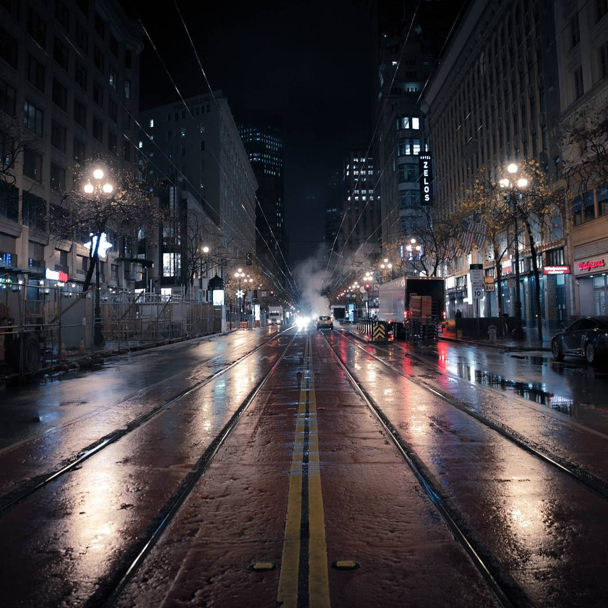
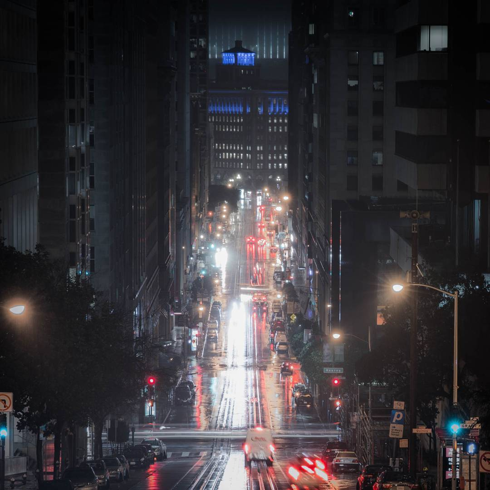
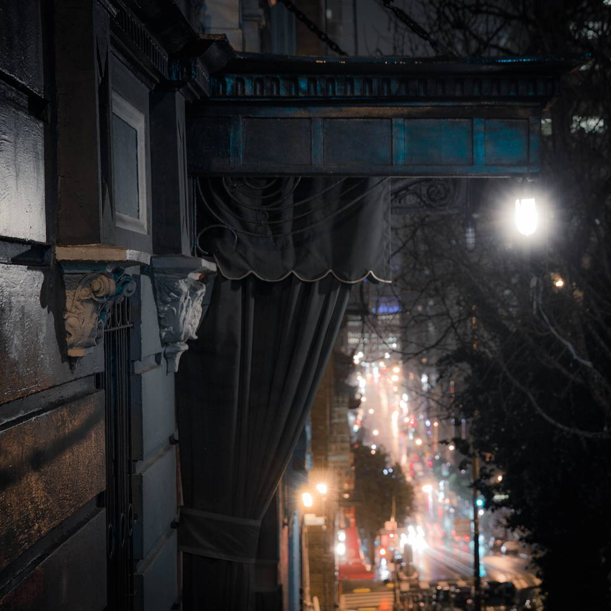
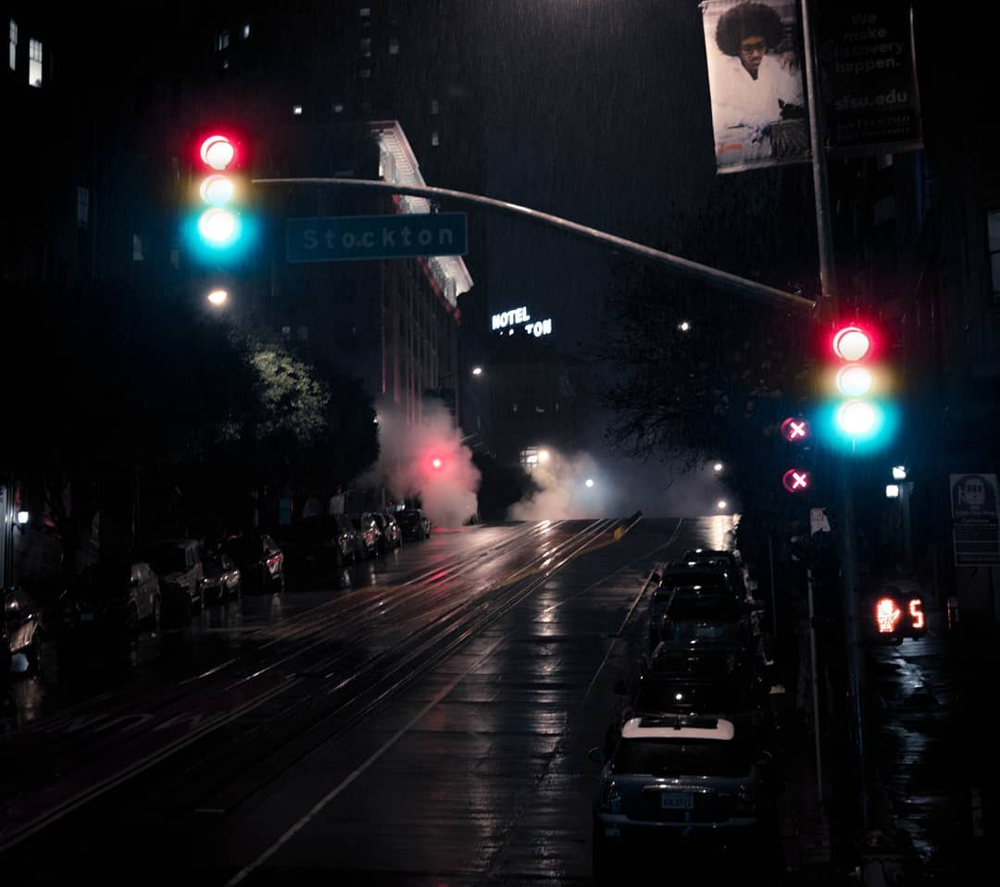
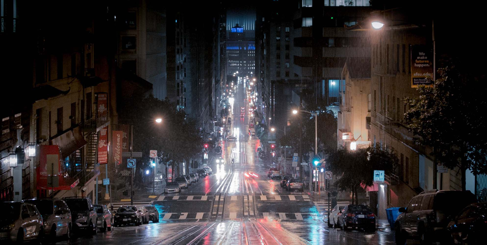
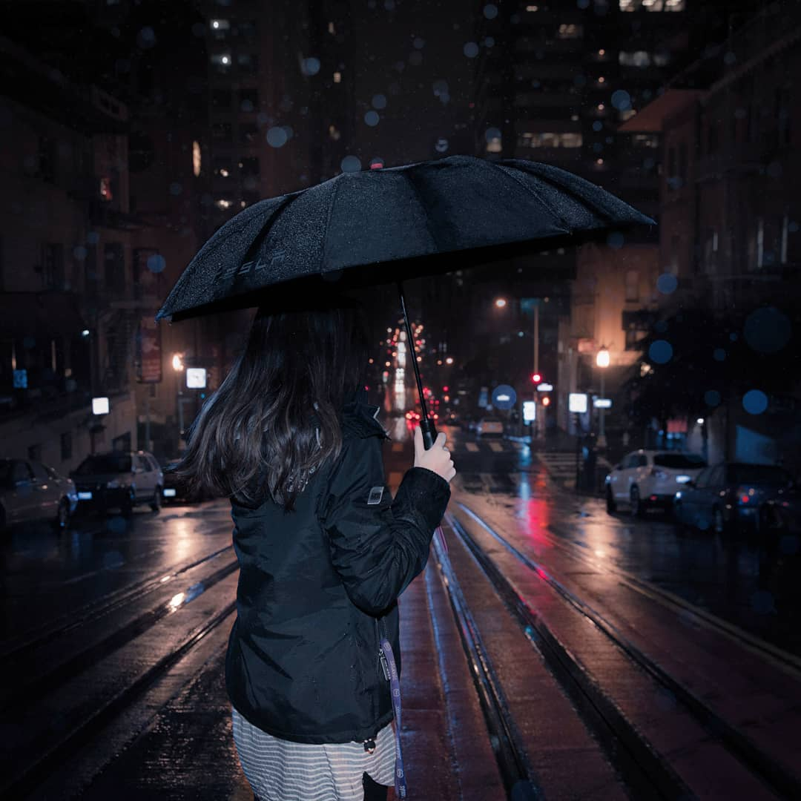
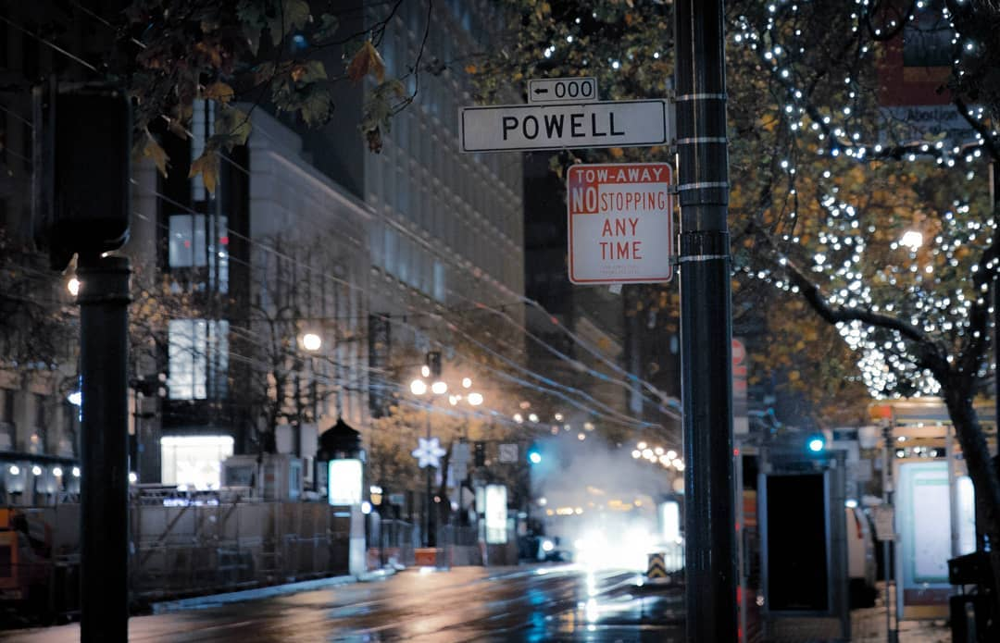
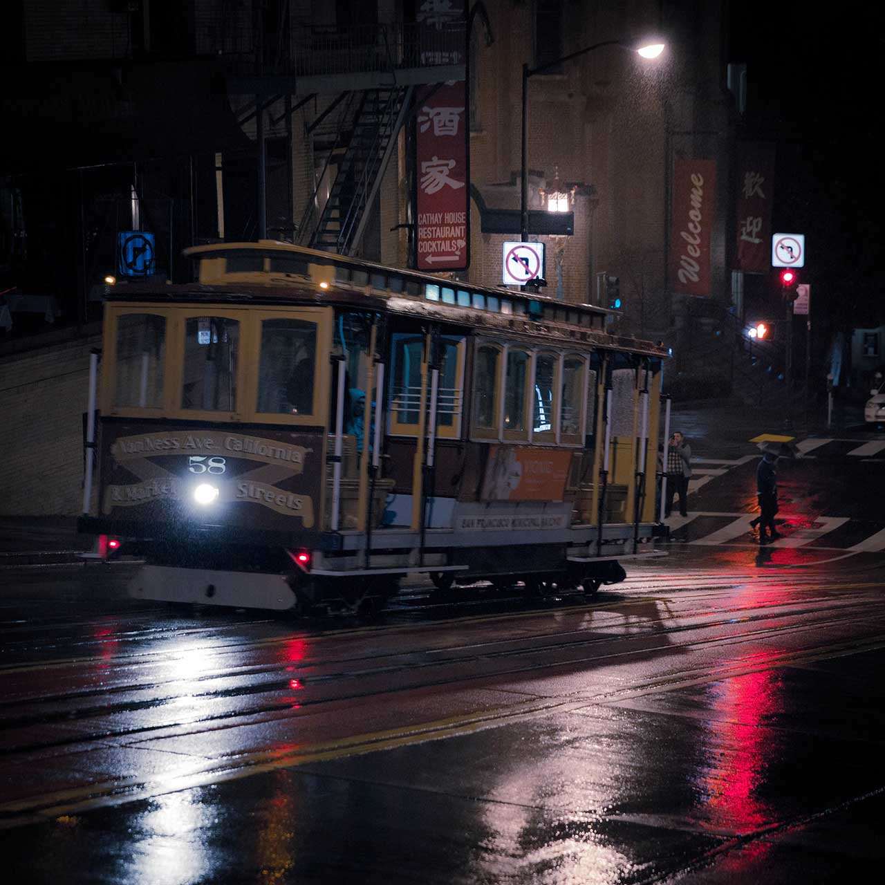

> It was a cold night out in San Francisco,  
> A thousand silver lines outside my window -  
> Stared at me. Intensely they stared into me.  
> I had to capture this than letting it be.  

> My next chance of revisiting this city -  
> Won't arrive before going through a journey.  
> Perhaps I will come back with an achievement -  
> But before that, let's remember this moment.  

> Gotta hop out of your comfort zone -  
> And leave your uncertainties behind.  
> Gotta commit from your skin to bones -  
> And go on a self improvement grind.  

> Suppose it could be a proper date next time?  
> Enjoyment was every moment spent with you -  
> From overbaking lamb and forgetting thyme,  
> To exploring London till black replaced blue.  

> What do you say for belated Valentine's -  
> Another dinner of just cakes through and through?  
> Whatever you may do, please bear this in mind -  
> I'll never not appreciate you, stay true.  

> When everything seem to be smooth -  
> You might feel an ill omen loom.  
> But, this is distant from the truth.  
> Please smile and let the flowers bloom.  
> The calm doesn't warrant a storm.  
> Relax. Isn't it nice and warm?  

> Things are rarely as they seem.  
> Most invisible is that -  
> Silver-lined seam.  

> Another as certain as death and taxes:  
> How do you handle an overflowing stress?  
> Deadlines loom and you took too many classes;  
> Times are low and you are met with great distress.  
