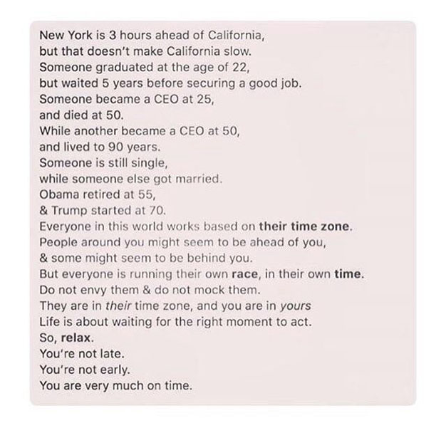

You’ll find no lack of motivational stories told through image macros or articles on social media.

For example:

###### 54.8K upvotes on Reddit at the time of writing

I don’t condemn the stories. I actually find the reasoning behind them quite noble: *the lack of success today doesn’t equate to the lack of success forever.* This idea has its merits, and there’s definitely some right of truth to it.

This sort of thinking has been around for quite some time. As soon as we grew old enough to comprehend fables, it was obvious that the ugly duckling would eventually become the swan. The outcast started with minimal degrees of success in terms of popularity. The odds were not in favor of the ugly duckling, and his experience was discouraging, grueling. However, he eventually found success despite everything.

###### @ielladoodle

If you are the ugly duckling, you shouldn’t be discouraged because you’ll find popularity eventually. **You’ll be fine.**

If you feel too old and unaccomplished, you shouldn’t be discouraged because your time just hasn’t come yet. **You’ll be fine.**

If you feel unmotivated at the moment, you shouldn’t be discouraged because motivation will strike one day. **You’ll be fine.**

If you are overweight and get mocked for it, you shouldn’t be discouraged because you should just appreciate your body. **You’ll be fine.**

If the jocks are out there for you because you are nerdy, you shouldn’t be discouraged because you’ll eventually become their manager. **You’ll be fine.**

**Just relax and you’ll be just fine.**

Right?

###### @iambeautiful

Congratulations, you’ve just been moti**wait**ed.

Hearing what you want to hear, you compromise with reality and trap yourself in your comfort zone, waiting for the right moment or the right opportunity.

You keep waiting, and wondering where that promised moment would arrive.

You keep waiting longer, and hate the World even more because it seems that the entire World is against you.

Eventually, you look back at the moment where you read these motivational stories. You remember making a decision between the options:

1. Taking the stories as reassurance for your confidence and staying proactive towards your goals
2. Taking the stories as a call to action and taking an initiative towards your goals
3. Taking the stories as Aspirin, numbing yourself and accepting discouraging circumstances

The bad news is that you won’t be able to go back in time to change your decision.

The good news is that you can change your decision. Now.

Don’t believe me? Don’t believe in the freedom of making your own decisions?

It’s understandable. A lot of external circumstances are impossible to change. You’re stuck with the cards you’re dealt. You can’t choose how others act towards you.

But there’s one freedom that nobody can take away from you: the freedom of the self.

The freedom to determine your own attitude and spiritual well-being. The freedom to manage your internal self. The freedom to play your cards in your order.

Don’t take it from me; take it from author/professor/holocaust survivor Dr Viktor Frankl, whose parents, brother, and wife perished in concentration camps.

> We must never forget that we may also find meaning in life even when confronted with a hopeless situation.

And I think that’s the best takeaway from those motivational stories: 

#### If you can’t change the situation, change your attitude. Reorient yourself towards your goals in life, then take stride with confidence.

So, what do you choose?

Will you be moti**wait**ed, or motivated?
