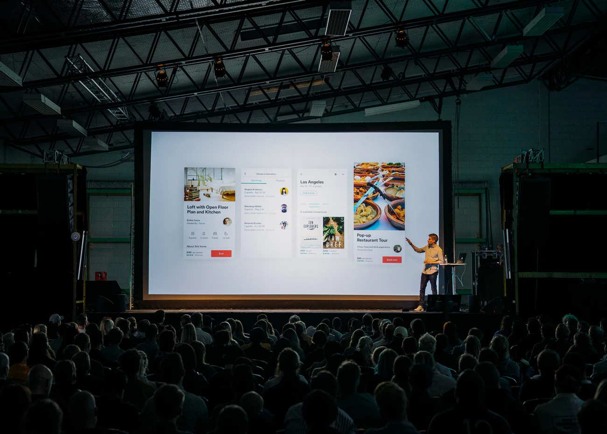

Hi, today, I’d love to share my personal experience on hackathons, and clear up some of the confusion around them. Hopefully I can present a good enough case for some of you to consider attending your first one.

###### @cgower

Before telling my story, you might want to know what a hackathon is:

### What are hackathons?

A hackathon is typically a mini startup competition conducted over a weekend, where people gather in groups and build a minimally viable software product, then pitch their prototype at the end of 24 hours.

The word hackathon is a portmanteau of *hack* and *marathon*. *Hack* means “to quickly put together”, whereas *marathon* refers to the endurance required to work on-and-off for 24 hours straight.

### My story

Despite wanting to become a software engineer and taking relevant classes in college, knowing about data structures and time complexity didn’t exactly teach me how to make a website or extract data from a webpage. Right when I started wondering about this, a good friend asked me:

*How the hell did you go a whole year living in San Francisco without going to a hackathon?*

Which is funny in retrospect, because the first hackathon I went to was LA Hacks which, surprisingly, was not held in San Francisco.

This was my first experience building practical software. I was taught how to work with a team of people on Git, building part of a website and talking to JavaScript APIs.

I was a clueless student with hardly any contacts outside of my school. Then I became a slightly less clueless student with slightly more contacts.

This first taste was the gateway drug. Over a single weekend, I learned and grew by leaps and bounds — I thirsted for more. The more I learned about software engineering, the more I knew just how much more I could learn.

Someone I met from a hackathon taught me about databases. Smart contracts. UI/UX. Docker. AWS.

Someone I met from a hackathon brought me to hiking. To boardgame night. Steak dinner. Rocket-watching. Vacation in the Southeast Asia. Taiwan.

Someone I met from a hackathon became my smoking buddy. Business partner. Mentor. Brother.

I would not be where I am right now without meeting all these people and learning from them at hackathons. I would not have attended a school from the future. I would not have been doing business in the Philippines.

Going to that first hackathon definitely marked the beginning of a new chapter of my life.

There is no guarantee that attending a hackathon will be as transformative to your life as it was for mine. I do guarantee, however, that you will gain considerable value from experiencing a hackathon at least once.

###### @xteemu

### Why hackathons?

- **I want to network**  
    Aside from stickers, the biggest takeaway from hackathons are the people you meet. These events are a fine concentration of great engineers, designers, hustlers, and learners from the area. Ask them about their work/school or project ideas.
- **I want to learn and gain experience**  
    The best way to learn is through experience, and experience builds your portfolio. There’s next to no better chance to practice your favorite framework, or to try new ones.
- **I’m here for the swag and food**  
    Who could refuse stickers, t-shirts, hoodies, fidget spinners, and more — in addition to a full weekend of free food?
- **The prizes are attractive**  
    If you prove yourself against the other contenders, you could end you weekend with some extra recognition, tech gadgets, or even cryptocurrency.
- **I have no plans for the weekend**  
    You’ve been wanting to be productive, now here’s your chance.

### Why not hackathons?

- **Sleep is pretty important**  
    A lot of the times you will get so caught up in making progress you forget the progress of time.
- **Don’t agree with the how judging usually turns out**  
    One trend you’ll notice if you attend more is that great ideas and effort don’t necessarily always win. Usually it’s the skilled pitcher with a fancy UI using hyped-up technologies.
- **Costs outweighs benefits**  
    For example, if you already know a good number of tech personalities in your area, the value from networking might be diminished.

### What if I… (The stop-making-excuses section)

- **Am completely new to any roles?**  
    From my experience, people are more than willing to teach you even if you have no experience developing. The only requirement is your will to learn.
- **Don’t have a team?**  
    Many hackathons have team building sessions after the initial presentation. Even if they don’t, nothing stops you from walking around the room and checking for a group working on something that interests you and that would welcome you.
- **Rather not interact with others?**  
    While you can be your own team and still win prizes, hackathons are great opportunities for you to step out of your comfort zone! There will be little pressure for interaction in general, but it should be no difficult task to strike up a conversation if you’d like, given a room of like-minded people.
- **Didn’t win?**  
    Hey, at least you got stickers.
- **Don’t like free food?**  
    Seek professional help.

### How to find a hackathon to attend?

- [eventbrite.com](https://eventbrite.com)
- [hackathon.com](https://hackathon.com)
- [devpost.com](https://devpost.com)
- [google.com](https://google.com)
- [hackathon.io](https://hackathon.io)
- Let me know if there’s more!

### What else to consider?

- Proximity
- Your own schedule
- Prizes
- Travel reimbursements
- Sponsoring companies you want to check
- Judges you want to meet

###### @cikstefan

Now get out there and happy hacking!
