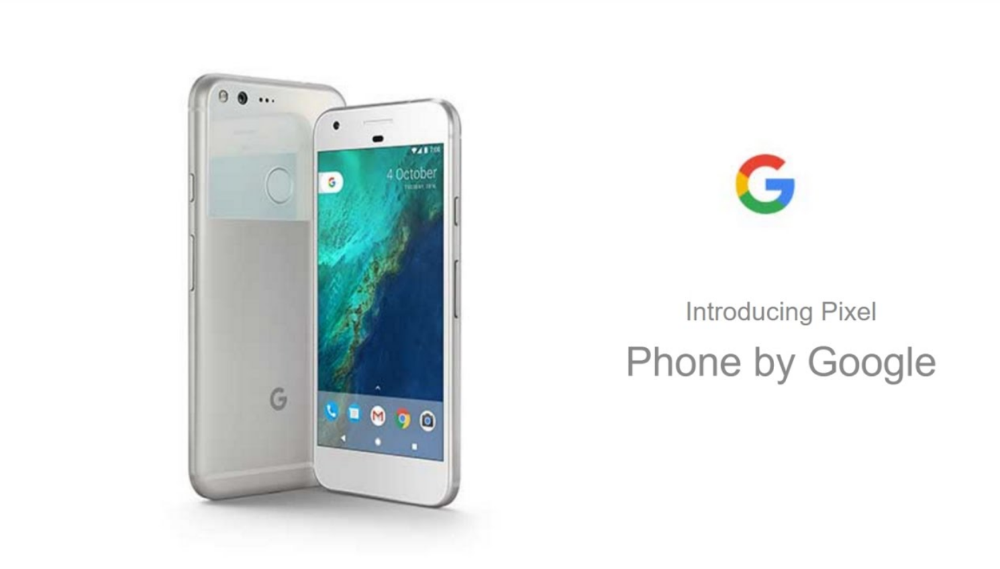
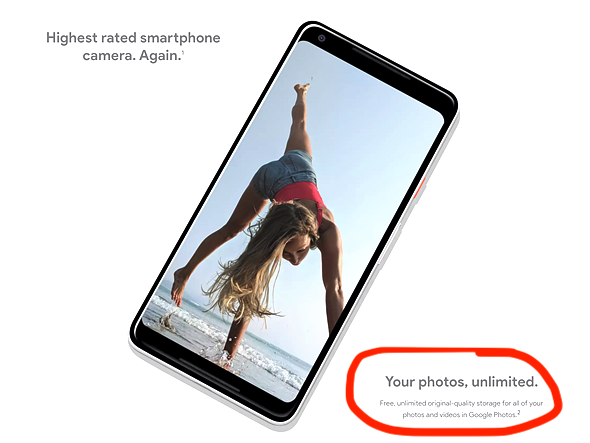
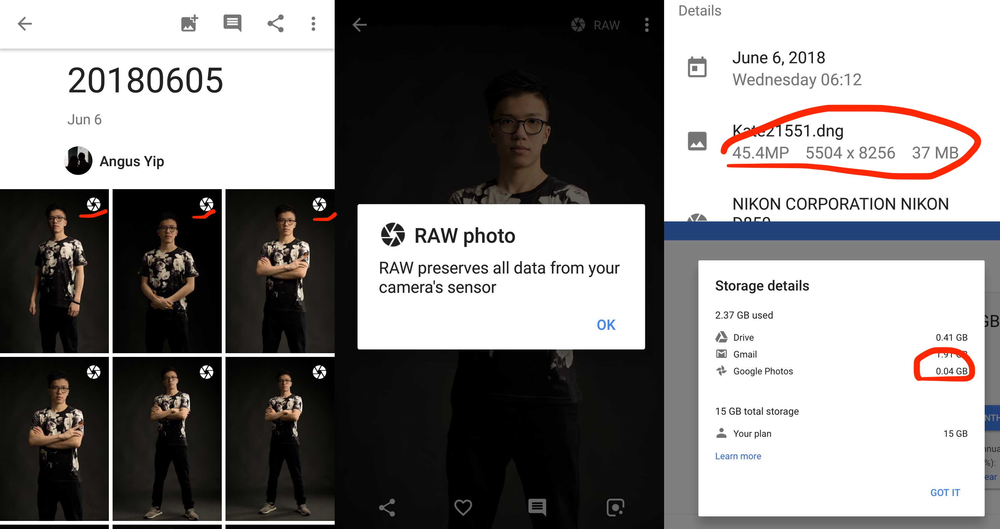

In my humble opinion, this is the best piece of photography gadget I ever owned:

Not the Pixel 2 or whatever number it is at the time you are reading this, but the original one.

As a general usage smartphone, the original Pixel is rather unimpressive for its price. However, I have not regretted this purchase for a single reason, which is also what makes the original Pixel the best photography gadget:

If you upload photos and videos from your original Pixel, those uploads will not count against your Google Drive storage. It may not be Google’s intention for people to just drag and drop RAW images onto their Pixels and upload them, but here is the end result:

That is why I swear by my Pixel. If this feature sounds useful to you, here is how you can take advantage of it:

## Getting started

Prerequisites: Google Pixel, Mac or PC, a fast WiFi connection, means to produce large photos or videos to justify doing this whole thing.

1. Get yourself an original Google Pixel. Since the unlimited upload feature is device-bound rather than account-bound, a used one works just fine.
2. Click the shutter button on top of your expensive DSLR/Mirrorless/Action Cam a few times, and import the resulting large pictures to a computer.
3. On the Pixel, log in to your Google Account.
4. Connect your Pixel to said computer. Unlock the Pixel and select “View files” or “Transfer photos”.
5. Drag and drop your saved pictures to a folder on the Pixel. No need to make a new folder; DCIM works just fine. Your Pixel might lag severely during this process, and might shut itself down, so it’s best not to interact with your Pixel throughout this step.
6. Now just connect your Pixel to a WiFi and give some time as it uploads gigabytes onto Google Photos.

Please use this power responsibly, and happy shooting!
